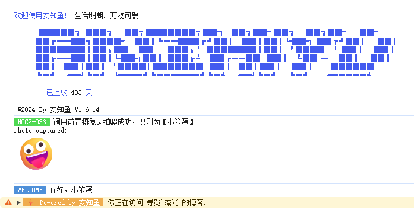
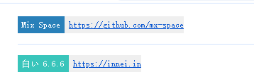
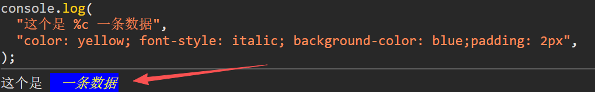

### 在此之前

在一些网站的控制台信息中，我们会发现一些品牌信息，比如：



---



这些本质上就是 `console.log()` 来实现的

### 如何实现

使用 %c 为打印内容定义样式：

```javascript
console.log('这个是 %c 一条数据', 'color: yellow; font-style: italic; background-color: blue;padding: 2px');
```


